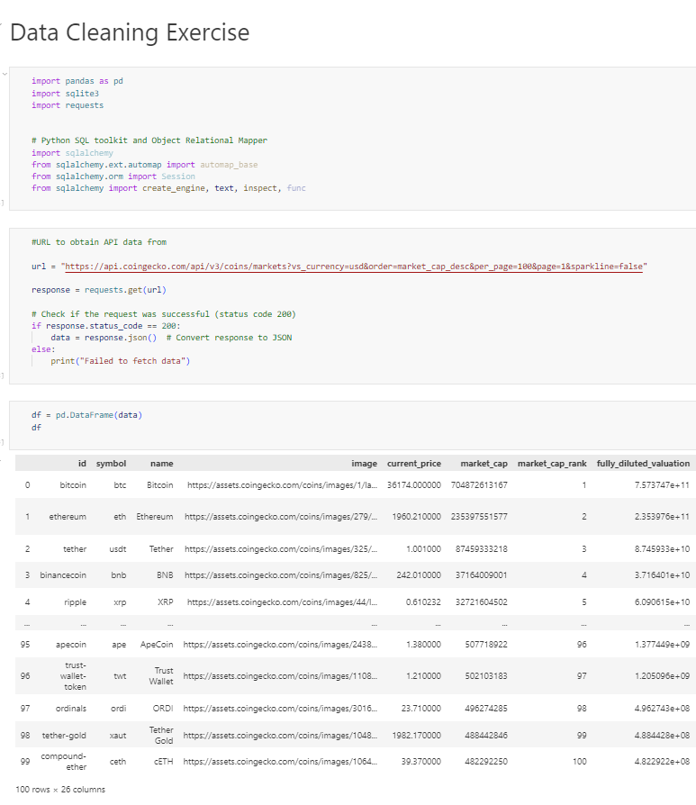
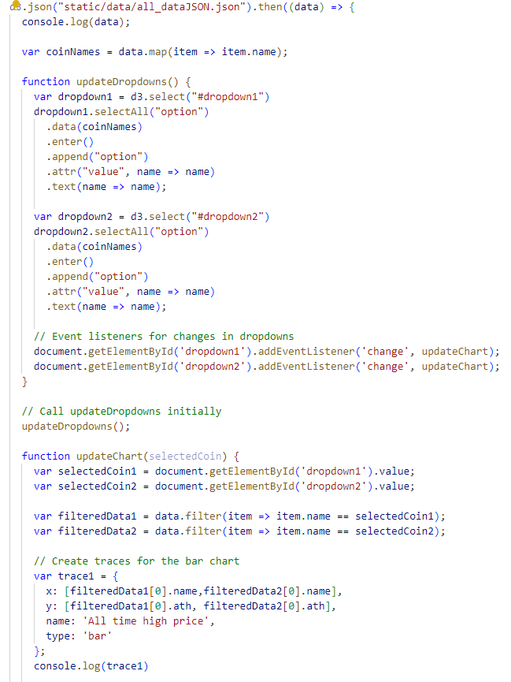
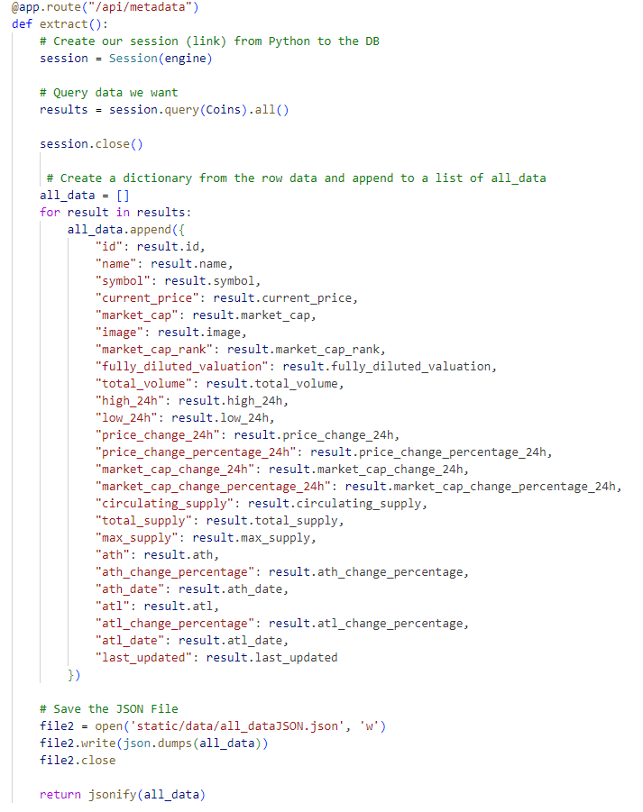
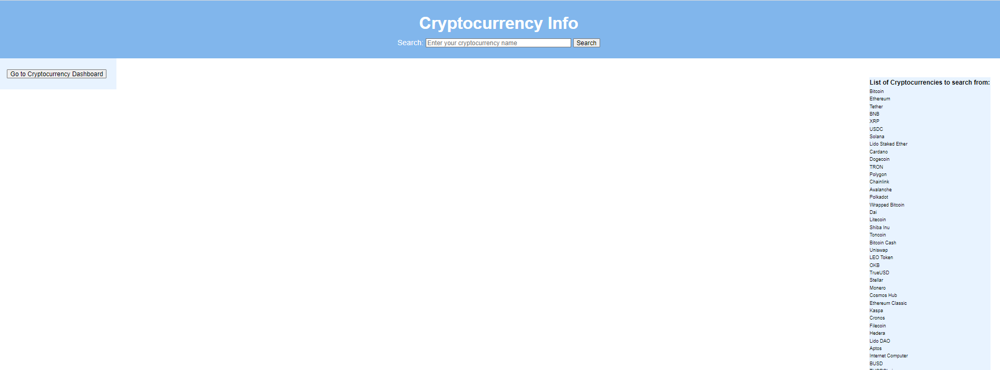
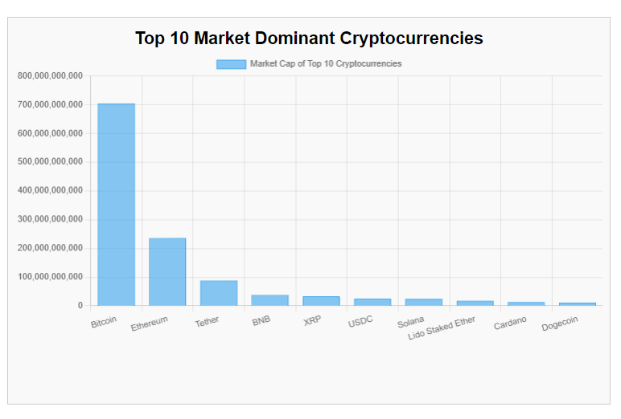
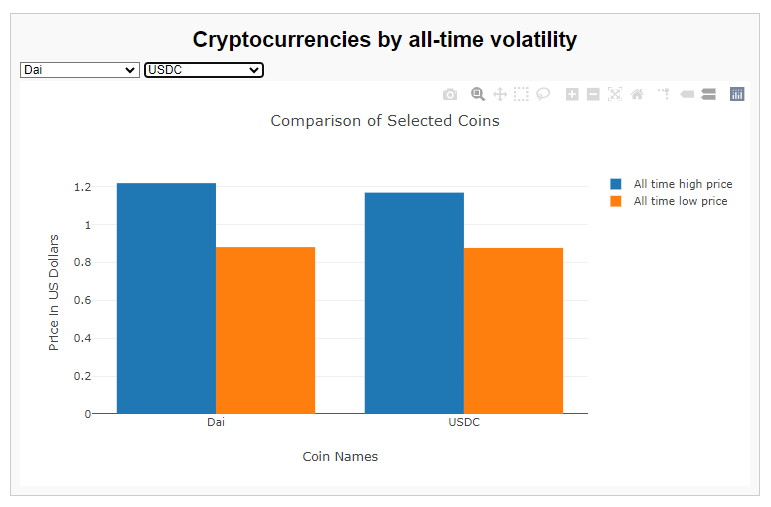
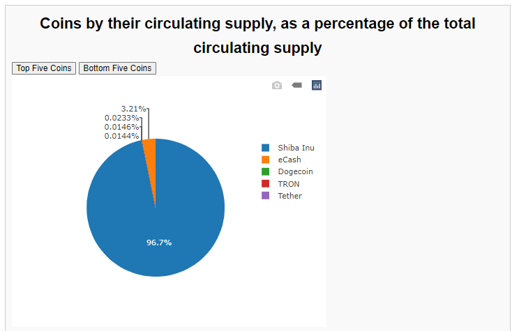

# CoinGecko-Project
A project to analyse cryptocurrency data, from data obtained through CoinGecko API.

# Contents:

[Team](#team) 
[Data collection](#data-collection) 
[Libraries](#libraries) 
[Languages](#languages) 
[How to use](#how-to-use) 
[Programs required](#programs-required)

# Team:

For this group project, the team members were the collaborators on this repository.
They are- Nev, Jo, Saki, Iana, Kaiser.

# Data collection:

In order to analyse cryptocurrency data obtained from CoinGecko's API site, at one specific point in time,
we pulled the data @ 16-11-2023, 23:31hrs.

This data was then converted to a JSON File, to use in our analysis and visualisation.
This was done using the FLASK route /api/metadata which generates the JSON file we
will use for our analysis.

# Libraries/Frameworks:

We used the following libraries in our project: 
    1. Pandas & Jupyter Notebook to clean the data and save it into SQLite3. Example below: 
     
    2. D3.js, Plotly.js and Charts.js to help us analyse and visualise our data. Example below: 
     
    3. Flask to locally host our webpage.
     

# Languages:
Languages used in this project are: 
    1. HTML and CSS to style and produce our webpage. 
     
    2. Javascript to query the data from the JSON File and create the visualisations. 
    
    
     

# How to use:

First, download this repository to your local drive.
Go to your terminal and navigate into this repository.
Type python app.py to load the local port where the project can be accessed.

You should get a message that says "Running on http://127.0.0.1:5000".
Ctrl + click on the highlighted IP Address.
This will load the Flask APP on your browser.

From here, you can select the api/metadata route to view the metadata.

To access the first page, you can select the /html/metadata route.
This will take you to our homepage of our website.
Here, you can select a coin from the list on the right hand side to query the metadata for each coin.

Next, select the Go To Dashboard button, which will take you to our dashboard page.
On this page, you can view the below charts and interact with them.
This will allow you to visualise some data from our database.

# Programs required:
The prerequisites you require to run our project are:

Jupyter Notebook  
Python  
SQLite3  
Javascript  

